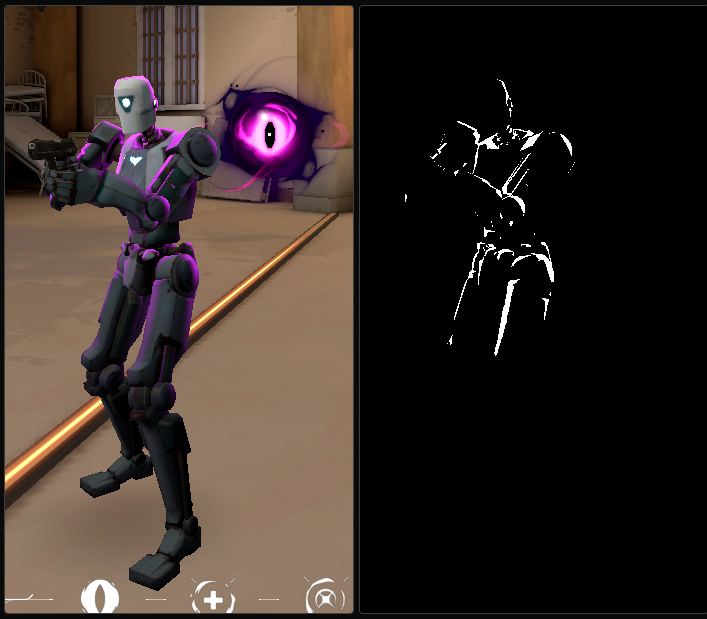

# Valorant Colorbot 🎮

Color-based aimbot + triggerbot for Valorant.  
Implemented in **C++ (Windows API, OpenCV)** for capture and detection, with an **Arduino Leonardo** handling HID mouse emulation.

---

## ⚠️ Disclaimer
This project is for research and educational purposes only.  
Using Aim-assist tools in online games violates terms of service and may result in bans.

⚠️⚠️You will have to change your Leonardo’s HID and PID to match your mouse’s.⚠️⚠️

---

## 🔍 Overview
- **Screen Capture**: 250×250 pixel region via `BitBlt`.  
- **Color Filtering**: Conversion to HSV + `inRange` to isolate enemy outline color (purple).  
- **Target Detection**: Search within a circular FOV; pick the topmost matching pixel.  
- **Aiming**: Calculate relative delta to screen center; apply linear smoothing for natural motion.  
- **Triggering**: Automatic click when a valid target is inside FOV.  
- **Arduino HID**: Serial communication with Arduino (Leonardo) for hardware-level mouse input.  
- **Serial Com**: Communication handled through the [`SerialPort`](https://github.com/manashmandal/SerialPort) library.  

---

## ✨ Features
- Fast region-based capture  
- HSV outline detection  
- Smoothed mouse movement  
- Aimbot + triggerbot functionality  
- Hardware-level input via Arduino HID  
- Serial communication layer using **SerialPort** lib 

---

## 🖼️ Image Processing Example

---

## 🎥 In Action

---

## 📝 Notes
- 🎯 HSV values define detection accuracy  
- 🎛️ FOV and smoothing determine responsiveness and precision  
- ⚡ Arduino + SerialPort lib provide HID-level control with minimal detection surface  

---

## 🌃 End of the Line, Choomba  
Thanks for checking out this little project.  
May your tracking stay sharp.🎯

